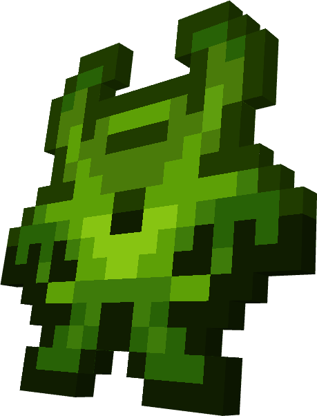
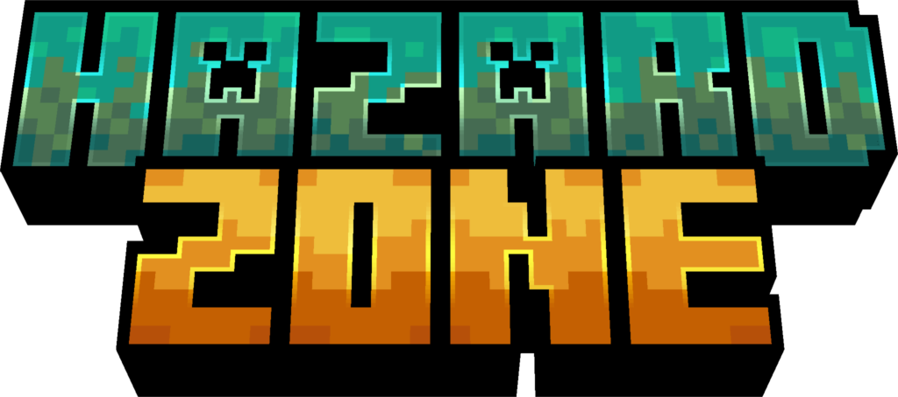

 

 

**HazardMod** is a WIP Minecraft mod for NeoForge 1.21 focused on post-apocalyptic themes, mutation systems, and hazardous environments. The core design is open-ended and evolving. Expect experiments with custom mobs, dangerous biomes, gear progression, and contamination mechanics.

   

# Concept Overview

> [!NOTE]
> This mod is still in its early development stage. All content is subject to change. Features, items, and names are placeholders or prototypes.
> 

HazardMod is being built as a flexible framework for mutant survival gameplay. Current plans may include:

- Radiation or contamination zones  
- Mutant-inspired mobs  
- Protective gear and utility items  
- Biome effects or altered worldgen  
- Progression through crafting, research, or DNA manipulation  

The goal is to create a mod that's both standalone-compatible and modpack-friendly.

---

# 🧪 Development Goals

While no core features are final, the intended direction includes:

• Hazardous environments that affect player behaviour  
• Unique mob types with mutations or behaviour variants  
• Equipment or crafting systems tied to survival and control  
• Support for datapacks, JEI, and modpack scripting  
• Visual and gameplay feedback that makes danger feel immersive  

Everything is still subject to design iteration.

---

# 📷 Placeholder Screenshots

*(All visuals below are temporary or concept only)*

---

# Changelog

### [0.0.1] - Initial Project Setup
- Established mod structure and Gradle config  
- Basic asset pipeline and textures  
- Placeholder mob and zone testing  
- GitHub repo, project details  

---

## 📥 Installation

1. Requires **NeoForge 1.21**  
2. Place `.jar` in your Minecraft `/mods` folder  
3. Optional: JEI 

---

## 🧾 License & Contributions

MIT Licensed  
Mod ID: `hazardmod`  
Pull requests welcome. Suggestions and collaboration encouraged during WIP.

---

## 🚧 This is Just the Beginning

This is a modular and evolving project. Expect frequent changes, experimental features, and feedback-driven development. Join the discussion via GitHub Issues or project discussions.

